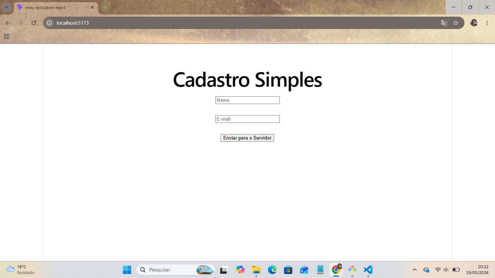
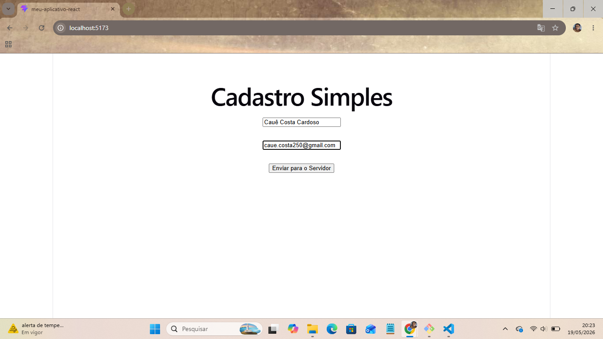
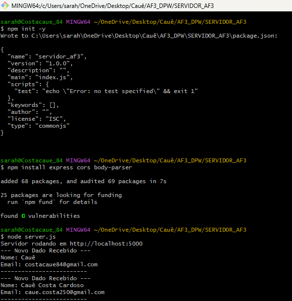
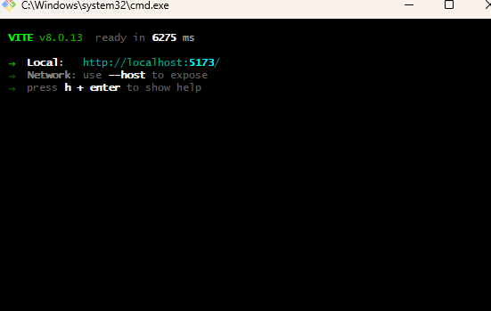

# Avaliação Formativa - Desenvolvimento Para Web (AF3)

Este projeto consiste em um sistema de cadastro simples integrado, desenvolvido para fins acadêmicos. Ele demonstra a comunicação entre uma aplicação Front-end em **React** (utilizando Vite) e um servidor Back-end em **Node.js** com **Express**.

## 🚀 Tecnologias Utilizadas

### Front-end
- **React.js** (com Vite)
- **Hooks (useState)** para gerenciamento de estado dos inputs e respostas
- **Fetch API** para comunicação assíncrona com o servidor

### Back-end
- **Node.js**
- **Express.js** para criação da API e gerenciamento de rotas
- **CORS** para permissão de requisições cruzadas entre domínios locais
- **Body-Parser** para tratamento de requisições em formato JSON

---

## 🛠️ Como Executar o Projeto Localmente

Certifique-se de ter o [Node.js](https://nodejs.org/) instalado em sua máquina antes de iniciar.

### 1. Clonar o Repositório
```bash
git clone [https://github.com/ccsta/AF3_my-react-app.git](https://github.com/ccsta/AF3_my-react-app.git)
cd AF3_my-react-app
---

## 📷 Demonstração da Aplicação

### Interface do Formulário (Vazio e Preenchido)



### Logs do Servidor Node.js Express


### Erro de Conexão Recusada (Porta Incorreta)
